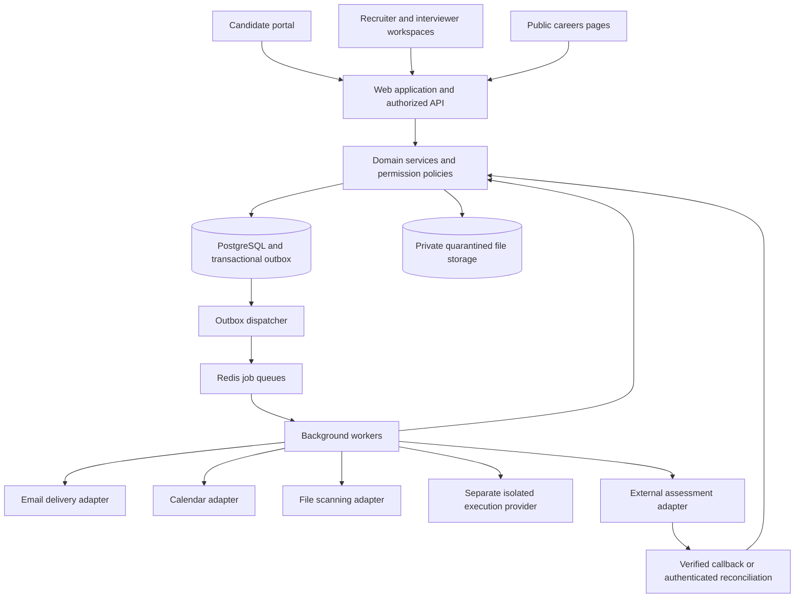
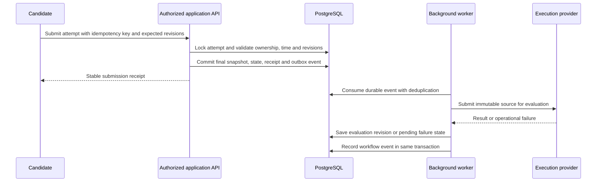

# Claude Code master build prompt: unified hiring and assessment platform

Copy this entire document into Claude Code, or place it in the repository and instruct Claude Code to read and execute it. Everything below is addressed to the implementation agent. This is an original product specification, not a claim to reproduce the private architecture, question libraries, or proprietary interfaces of Greenhouse or HackerRank.

## 0. Your assignment and completion contract

Act as a principal software engineer, product engineer, application security engineer, and test engineer. Build a complete, working, multi-tenant recruiting and assessment application named **TalentFlow**. Use the name as an easily changeable configuration value. Deliver implemented software, persistent data, migrations, automated tests, working local infrastructure, realistic demo content, documentation, and deployment instructions. A design document or a collection of static screens does not complete this assignment.

Combine these capabilities in a coherent product:

1. Applicant tracking: careers pages, jobs, applications, candidate records, hiring pipelines, screening, interviews, feedback, offers, and reporting.
2. Assessments: reusable question libraries; multiple choice, numerical reasoning, written answers, file submissions, coding, SQL, spreadsheet work samples, and recorded-response exercises; test authoring; invitations; reliable test delivery; automatic and human evaluation.
3. Automation: configurable workflows connecting applications, assessment evidence, recruiter review, interviews, and offers.
4. Integration architecture: email, calendars, private file storage, isolated code execution, and external assessment adapters.
5. Operational foundations: tenant isolation, authorization, audit history, retries, recovery, monitoring, data retention, accessibility, and useful administration.

Make routine engineering decisions autonomously. Inspect the repository and its instructions first. Preserve existing work. If the repository is empty, scaffold it. If it contains a compatible application, extend it rather than resetting it. Ask a question only when the answer is necessary to prevent a destructive action or a material product mistake. Document reasonable assumptions and continue independent work.

Do not silently shrink scope to a landing page, dashboard mockup, or disconnected CRUD demo. Implement in phases, but the phases sequence the work; they do not make later requirements optional. Do not stop after producing a plan. Do not assert that a feature works unless it has been implemented and verified. Do not claim that tests passed unless you ran them. If credentials or infrastructure prevent verification, state exactly which capability is blocked and which tests were executed.

Do not prescribe or maximize a line count. Write maintainable code with clear contracts and focused modules. Comments should explain non-obvious reasoning and invariants, not narrate every statement. Prefer explicit domain behavior over clever generic frameworks.

### 0.1 Required execution artifacts

Create and maintain:

- `docs/BUILD_PLAN.md`: phased checklist and dependencies.
- `docs/REQUIREMENTS_MATRIX.md`: requirement IDs from this specification mapped to implementation files and executable tests.
- `docs/ARCHITECTURE.md`: system boundaries, diagrams, decisions, data flow, trust boundaries.
- `docs/DATA_MODEL.md`: entities, relationships, indexes, deletion policy, permission boundaries.
- `docs/SECURITY.md`: threat model and implemented controls, with honest limitations.
- `docs/OPERATIONS.md`: startup, migrations, backup/restore, queues, recovery, production configuration.
- `docs/TEST_REPORT.md`: commands actually executed, results, environment, unresolved failures.
- `docs/IMPLEMENTATION_STATUS.md`: completed work, remaining work, next executable steps, exact resume commands.
- `docs/PROVIDER_CAPABILITIES.md`: real, simulated, unavailable, and credential-dependent integrations.
- `docs/DECISIONS/`: short architecture decision records for meaningful tradeoffs.

If the context window becomes small, update these documents before handoff. On resumption, read them and continue from the existing implementation. Never represent a context limit as product completion.

## 1. Product assumptions and explicit boundaries

**REQ-PRODUCT-001:** This is a business-to-business SaaS application. A company is a tenant. Users can belong to multiple companies through memberships. Employers never see another employer's candidates, tests, scores, files, notes, analytics, or configuration.

**REQ-PRODUCT-002:** Candidate identity and employer-owned candidate records are separate. A verified candidate account may access applications belonging to that candidate across employers, but the employers cannot access each other's records. Do not perform cross-employer candidate search or cross-employer résumé deduplication.

**REQ-PRODUCT-003:** A person may apply to multiple jobs. A candidate profile is employer-scoped. Each application has its own pipeline position, history, assessments, interviews, decisions, and offers.

**REQ-PRODUCT-004:** Assessment results are evidence, not an implicit hiring decision. Human review is the default. Employers may enable explicit, versioned automation using supported structured criteria. Every automated decision stores the policy version and evidence used. No opaque universal employability score.

**REQ-PRODUCT-005:** Build original styling and original sample assessment content. Do not scrape commercial question banks or copy protected product assets. Do not claim scientific validation of demo assessments or prediction of employee performance.

**REQ-PRODUCT-006:** The complete local product must be usable without paid credentials. Use real local persistence, SMTP capture, object storage, queues, and human/manual assessment paths. Provider simulators may demonstrate remote integration states, but must be visibly marked as simulated and cannot count as verified remote execution.

**REQ-PRODUCT-007:** Real code execution requires a configured, isolated execution provider. Never solve missing credentials by running untrusted submissions on the web server, worker host, development shell, or production database. A disabled real runner must produce an explicit unavailable state, not a fabricated score.

**REQ-PRODUCT-008:** Commercial billing, payroll, background-check adjudication, native video conferencing, a proprietary compiler sandbox, and enterprise SAML/SCIM are outside this first complete product. Document extension points. Implement the hiring and assessment capabilities in this specification fully. Google/Microsoft calendar connectors and commercial assessment vendors may remain credential-dependent; baseline scheduling and manual result import must work.

## 2. Technology choices and dependency verification

Use these default choices unless the existing repository gives a strong reason otherwise. Verify current compatible stable releases against official documentation before installation. Pin dependencies with a lockfile. Record the selected versions and compatibility reasoning. Do not invent version numbers or install prereleases by default.

| Concern | Default |
|---|---|
| Language | TypeScript with strict compiler settings |
| Web application | Next.js App Router and React |
| Styling | Tailwind CSS, accessible component primitives, a small consistent component library |
| Forms and validation | React Hook Form where helpful; Zod at all trust boundaries |
| Database | PostgreSQL |
| Database access | Prisma with explicit SQL migrations where constraints or row security require SQL |
| Authentication | A maintained Next.js-compatible authentication library; choose and document it, do not implement password crypto yourself |
| Background jobs | BullMQ with Redis; PostgreSQL transactional outbox is the durable source for dispatch |
| Files | S3-compatible private object storage; local MinIO or equivalent |
| Mail | SMTP transport and local Mailpit capture; adapter for hosted delivery |
| Editor | Monaco or an accessible equivalent, lazy-loaded only on coding routes |
| Code runner | A documented Judge0-compatible adapter for a separately administered service |
| Unit/component tests | Vitest, React Testing Library |
| Browser tests | Playwright |
| Local infrastructure | Docker Compose for database, Redis, object storage, mail, and file scanning |
| Observability | Structured logs, request IDs, metrics endpoints, health/readiness, optional tracing |
| Workspace | pnpm workspace, one lockfile |

Use a modular monolith, not a fleet of unnecessary microservices. Deploy the web process and background workers separately. Keep the untrusted execution service outside both. Start with PostgreSQL search and indexes; do not require a separate search cluster just to search candidates.

If your package selections have incompatible peer versions, resolve the incompatibility deliberately. Do not suppress it with force flags and move on. Do not use a cloud-specific runtime feature that makes local development impossible.

## 3. System layout and module boundaries





Suggested repository structure; adapt to actual framework conventions without losing these boundaries:

```text
apps/
  web/
    src/app/                    # Pages, route handlers, layouts
    src/components/             # Product-level UI composition
    src/server/                 # Session resolution, request context, composition root
  worker/
    src/main.ts
    src/processors/
    src/schedulers/
packages/
  domain/
    src/identity/
    src/companies/
    src/jobs/
    src/candidates/
    src/applications/
    src/assessments/
    src/attempts/
    src/evaluations/
    src/workflows/
    src/interviews/
    src/offers/
    src/reports/
    src/privacy/
  database/
    prisma/schema.prisma
    prisma/migrations/
    src/tenant-transaction.ts
    src/repositories/
    src/seed/
  contracts/                    # Request/response schemas and provider interfaces
  integrations/                 # Mail, calendar, execution, assessment providers, storage
  ui/                           # Accessible reusable primitives
  testing/                      # Factories, test auth helpers, controlled clocks
tests/
  integration/
  contracts/
  e2e/
  security/
  load/
infra/
docs/
```

### 3.1 Dependency direction

- UI calls an application API or server service; UI components never import unrestricted database clients.
- Request handlers authenticate, validate, resolve trusted context, call a use case, and serialize a safe DTO.
- Use cases own permissions, transactions, business rules, and event creation.
- Domain functions hold scoring, transition validation, deadline calculation, and other deterministic rules without framework dependencies.
- Repository methods require a trusted tenant context or a deliberately narrow candidate access context.
- Provider adapters implement explicit interfaces. The domain must not depend on provider-specific response shapes.
- Workers call the same application services and policy checks where applicable; they do not bypass invariants with ad hoc SQL.
- Server-only answer keys, hidden tests, credentials, and unrestricted records never enter client bundles or candidate DTOs.

### 3.2 Request context

Create a typed context containing actor identity, actor type, membership ID where applicable, company ID, request/correlation ID, authentication strength where applicable, and granted resource access. Resolve company membership on the server. A company ID in a URL or JSON body is a request to access that company, not proof of authorization.

Candidate endpoints derive their resource grants from a verified candidate session and ownership links. A candidate must not become a company member to take a test. Public careers endpoints use public-safe queries and published records only. Avoid a generic system-admin bypass for normal traffic.

## 4. Identity, access, and company isolation

### 4.1 Roles and permissions

Implement role defaults plus job-team scoping. Use explicit permission names and a centralized policy evaluator. Roles alone are insufficient: an interviewer must also be assigned to the relevant interview or review task.

| Actor | Allowed | Restricted |
|---|---|---|
| Owner | Company settings, members, all hiring work, ownership transfer | Cannot remove the last owner |
| Admin | Members, configuration, hiring operations | Cannot silently transfer ownership |
| Recruiter | Assigned jobs, applications, communication, assessments, scheduling | Compensation and administrative secrets require extra grants |
| Hiring manager | Assigned job candidates, evaluations, decisions and approvals | No unrelated jobs or company-wide administration |
| Interviewer | Assigned interview packet and own feedback | No unrelated candidates, hidden test keys, or other interviewers' unsubmitted feedback |
| Assessment author | Question banks, drafts, publication when granted | No candidate personal data unless separately granted |
| Assessment reviewer | Assigned responses and rubric | Minimal identity information; no unrelated applications |
| Analyst | Authorized aggregate reports | No unrestricted candidate export by default |
| Candidate | Own applications, assignments, submissions, released results and offers | No internal notes, hiring deliberations, hidden tests or other candidates |

Implement permissions such as `job.manage`, `application.read`, `application.move`, `assessment.author`, `assessment.publish`, `evaluation.grade`, `offer.manage`, `offer.approve`, `report.read`, `candidate.export`, `integration.manage`, and `member.manage`.

### 4.2 Authentication behavior

- Staff sign-up creates a company and owner membership transactionally or accepts a valid invitation.
- Invites are email-bound, time-limited, single-use, stored as token hashes, and revocable.
- Staff can switch only among companies with active memberships.
- Candidate application email ownership must be verified before existing application information is displayed or linked to an account.
- Use maintained-library email/password or passwordless flows, password reset, session revocation, and verified email.
- Use secure, HTTP-only cookies in production, appropriate same-site behavior, CSRF defenses for cookie-authenticated mutations, and documented session expiration.
- Rate-limit authentication, magic-link requests, invitations, public applications, uploads, and code execution independently.
- Return non-enumerating responses for unauthenticated email lookup and recovery flows.
- Removing a membership immediately prevents future authorized access; do not trust an indefinitely stale session role.
- No production demo login, hardcoded admin credentials, universal bypass token, or user-switching widget.

Next.js requires server-side authorization at each entry point; hiding controls is not an access control. Follow its [authentication guidance](https://nextjs.org/docs/app/guides/authentication) when implementing handlers and server functions.

### 4.3 Database isolation

All employer-owned tables contain `company_id`. Use unique `(company_id, id)` constraints and composite foreign keys where necessary to make cross-company links impossible. Enforce tenant scoping in repositories and PostgreSQL row-level security on employer-owned tables as defense in depth.

Use a restricted runtime database role, not the migration owner or a role with `BYPASSRLS`. Set tenant context transaction-locally on the same connection as the queries. Missing context must deny access. Never leave session-scoped tenant settings on pooled connections. Test reads, inserts, updates, deletes, background jobs, nested relations, search, exports, and file grants with two companies. Implement narrow public and candidate access paths without exposing all tenant rows. PostgreSQL documents important owner and bypass behavior in its [row security reference](https://www.postgresql.org/docs/current/ddl-rowsecurity.html).

## 5. Persistent data model

Use UUIDs, UTC timestamps, explicit status enums, deliberate nullability, and database constraints. Store display timezone separately as an IANA timezone. Money uses integer minor units plus currency. Scores use fixed precision, rational components, or integer basis points; avoid floating-point threshold ambiguity. JSON is for versioned question payloads and provider envelopes, not a replacement for relational ownership.

### 5.1 Identity and organization

- `User`: id, verified email, display name, authentication-library linkage, status, created/updated timestamps.
- `Company`: id, name, unique careers slug, branding settings, default timezone, status, retention settings.
- `Membership`: company/user references, role, status, unique company/user pair.
- `MemberInvitation`: company, intended email, role, token hash, expiry, accepted/revoked timestamps.
- `JobTeamMember`: company, job, membership, job-scoped role/grants.
- `CandidateIdentityLink`: verified user, company candidate reference, verification evidence and linked timestamp. No automatic unverified linking.

### 5.2 Hiring

- `Job`: company, title, slug, department, locations, work arrangement, employment type, description, compensation visibility and range, status, owner, timestamps.
- `JobRevision`: immutable published job description and application form version snapshots.
- `PipelineStage`: company/job, name, category, position, active status, settings. Stable IDs survive renaming.
- `Candidate`: company, name, email plus conservative normalized email, phone optional, source, consent metadata, profile fields.
- `Application`: company, job, candidate, job revision, lifecycle status, current stage, version counter, source, submitted/closed timestamps.
- `ApplicationAnswer`: application, form-field snapshot identifier, typed value, submitted snapshot.
- `ApplicationStageEvent`: previous/new stage, actor, reason, policy execution reference, timestamps.
- `CandidateNote`: company, candidate/application, author, sanitized content, explicit visibility.
- `Tag` and `CandidateTag`: company-local labels and relationships.
- `SavedView`: company/user, validated filters, sort order, visibility.
- `Communication`: company/application, template version, recipient reference, delivery status, provider reference, timestamps; avoid storing unnecessary copies of sensitive content.

### 5.3 Assessments

- `Question`: company, stable logical identity, type, tags, owner, archived flag.
- `QuestionVersion`: immutable published prompt, response schema, scoring configuration, rubric reference, difficulty label and accessibility notes. Store answer keys in a server-only table or repository boundary.
- `CodingTestCase`: question version, visibility sample/hidden, input, expected result, weight, resource policy reference.
- `RubricVersion`: dimensions, anchored rating levels, weights, instructions, publication state.
- `Assessment`: company, name, description, owner, archive state.
- `AssessmentVersion`: version number, draft/published status, timing policy, instructions, scoring model, score-release policy, content hash.
- `AssessmentSection`: version, title, position, instructions, weight, selection rules.
- `AssessmentItem`: section, pinned question version or published pool-selection rule, points, position.
- `AssessmentAssignment`: application, pinned assessment version, invitation due time, attempt allowance, accommodations, status.
- `Attempt`: assignment, ordinal, status, started/submitted timestamps, original/effective deadline, submission reason, version counter.
- `AttemptItem`: attempt, frozen selected question version, frozen order, frozen choice permutation. This preserves reproducibility for randomized tests.
- `Response`: attempt item, typed answer, latest acknowledged revision, updated timestamp.
- `ResponseRevision`: bounded history or audit metadata for concurrency/recovery; do not retain every keystroke indefinitely.
- `SubmissionSnapshot`: immutable final response set or immutable references plus content hash and final accepted revision map.
- `CodeRun`: attempt item, sample/final mode, source snapshot, provider token, status, safe summarized output, resource usage where available.
- `Evaluation`: attempt, evaluation revision, rubric/scoring version, automatic/manual/external origin, completeness, raw scores, scale metadata, creator, superseded reference.
- `CriterionScore`: evaluation, criterion, awarded/possible points, justification, evidence references.
- `ReviewTask`: application/attempt, assigned reviewer, state, due date, rubric version.
- `IntegrityObservation`: limited factual signal, timestamp, explanation, review state; never an automatic cheating verdict.

### 5.4 Interviews, offers, automation and operations

- `Interview`: application, type, start/end UTC, display timezone, location/link, status, calendar references.
- `InterviewParticipant`: interview, interviewer/candidate references, invitation status.
- `InterviewScorecardVersion`: published criteria and anchored ratings.
- `InterviewFeedback`: interview, reviewer, version, draft/submitted state, ratings, evidence, recommendation.
- `Offer`: application, lifecycle state, current revision, approval policy.
- `OfferRevision`: immutable terms, currency, start date, attachments, message, creator.
- `OfferApproval`: offer revision, designated approver, decision, timestamp, reason.
- `OfferResponse`: candidate identity, exact revision, accepted/declined timestamp; do not call this a certified e-signature service.
- `WorkflowRuleVersion`: trigger, validated conditions, actions, activation state, author, version.
- `WorkflowExecution` and `WorkflowActionExecution`: event/rule linkage, input snapshot, action state, idempotency key, result/reason.
- `OutboxEvent`: tenant, aggregate, type, schema version, minimal payload, recorded time, delivery state.
- `ConsumerReceipt`: consumer/event pair, processing state and timestamps, unique pair.
- `WebhookReceipt`: provider connection, provider event ID or safe dedupe key, verified timestamp, processing result.
- `IntegrationConnection`: company, provider, capabilities, encrypted credential reference, state, last successful sync.
- `ExternalAssessmentBinding`: company, application/assignment, provider candidate/test identifiers and scale metadata.
- `FileObject`: company, ownership scope, random storage key, original display name, size, MIME, checksum, quarantine/scan state, deletion state.
- `AuditEvent`: actor, company, entity reference, action, redacted change summary, request ID, timestamp.
- `ExportJob`, `BulkOperation`, `DeletionRequest`, `RetentionRun`, `Notification`, `IdempotencyRecord`.

Add missing supporting tables when required; document them. Include tenant-aware indexes for common list queries, `(company_id, job_id, current_stage_id)`, candidate normalized email, assignment due dates, attempt status/deadline, pending outbox events, review tasks, and audit dates. Use cursor pagination with stable tie-breaking IDs.

## 6. State machines and non-negotiable invariants

### 6.1 Jobs and applications

- Job: `DRAFT -> PUBLISHED -> PAUSED/CLOSED -> ARCHIVED`. Republishing is explicit. Public applications are accepted only when published.
- Application lifecycle: `ACTIVE`, `REJECTED`, `WITHDRAWN`, `HIRED`. Pipeline stage is a separate field; do not encode every stage into lifecycle status.
- Reopening a rejected application requires permission and a recorded reason. Candidate withdrawal disables future candidate-facing automation.
- Stage transitions require an expected application version. A stale mutation returns a conflict with current safe state.
- The final stage transition, audit event, and outbox event are committed atomically.
- A candidate has at most one active application per job unless an explicitly implemented reapplication policy permits otherwise. Duplicate public requests use idempotency rather than creating duplicate records.
- Renaming/reordering a stage preserves historical meaning. Deleting a used stage is prohibited; archive it or move active applications through an explicit migration flow.

### 6.2 Assessment states

Separate assignment invitation state from attempt state:

- Assignment: `PENDING`, `INVITED`, `IN_PROGRESS`, `COMPLETED`, `EXPIRED`, `CANCELLED`.
- Attempt: `NOT_STARTED`, `IN_PROGRESS`, `SUBMITTED`, `GRADING`, `AWAITING_REVIEW`, `COMPLETED`, `VOIDED`.
- Provider/grade processing: `QUEUED`, `RUNNING`, `SUCCEEDED`, `RETRYABLE_FAILURE`, `PERMANENT_FAILURE`, `UNKNOWN`.

Do not encode every provider failure into the candidate's attempt state. A failed grading job leaves the submitted attempt intact and ungraded; it does not create a zero score. Invitation expiry means no start occurred within the allowed window. A started test reaching its deadline is automatically submitted using acknowledged answers, not marked as a never-started invitation.

Only one active attempt per assignment. Additional attempts require allowance and a new attempt record. A retry never overwrites the previous attempt. Voiding an attempt preserves evidence and reason, subject to retention policy.

### 6.3 Timing contract

- Distinguish `startBy` from optional `hardFinishBy`.
- A candidate can start when server time is strictly before `startBy`.
- Effective duration is the base duration multiplied by the granted accommodation multiplier, rounded up to whole seconds, plus any explicit extra seconds.
- Deadline is start time plus effective duration, capped by `hardFinishBy` when configured.
- Never start an attempt with a non-positive remaining window; show an actionable message.
- A response mutation is accepted only while the attempt is in progress and authoritative database time is strictly before its effective deadline.
- The deadline boundary is exclusive: an answer arriving exactly at the deadline is rejected.
- Server time is authoritative. Browser clocks, tab visibility, reconnects, and page reloads cannot extend time.
- Default policy does not pause on disconnect. Explain this before start. An authorized extension records who granted it, the reason, old deadline and new deadline, and reschedules expiry processing safely.
- Delayed workers never determine validity. Every answer and submission endpoint checks time and state itself. An expiry sweep repairs missed delayed jobs.

### 6.4 Publication and scoring

Published assessment versions and question versions are immutable. Assignment creation pins the version. Starting an attempt freezes selected questions and presentation order. Changes create new versions. Existing candidates continue on their assigned version.

Final evaluations are revisioned. Regrading creates a new evaluation with a reason and references the old result. A score update does not retroactively rerun an already completed hiring decision without an explicit workflow policy or human action.

## 7. User interface and route inventory

Build a polished, restrained business application with clear typography, consistent spacing, neutral surfaces, and one primary accent. No decorative dashboard numbers disconnected from real records. Use accessible controls and semantic HTML. Every feature includes loading, empty, error, unauthorized, validation, and success states. Changes survive refresh.

### 7.1 Public and authentication routes

- `/`: concise product entry page with real sign-in and company creation paths.
- `/sign-in`, `/sign-up`, `/verify-email`, `/forgot-password`, `/reset-password` as supported by the selected auth flow.
- `/invite/[token]`: staff invitation landing; token consumption occurs on explicit acceptance, not a scanner-triggered GET.
- `/careers/[companySlug]`: published job search, department/location/work-arrangement filters, accessible empty state.
- `/careers/[companySlug]/[jobSlug]`: full job description and application form.
- `/application/verify`: email verification flow without leaking whether an address has applied before.

### 7.2 Recruiter workspace

Use `/app/[companySlug]/...` or an equivalent consistent structure:

- `dashboard`: real pending reviews, upcoming interviews, active jobs, overdue actions, and recent activity.
- `jobs`: searchable/filterable job list and create job.
- `jobs/new` and `jobs/[id]/edit`: job details, application form, team, pipeline, publishing preview.
- `jobs/[id]/pipeline`: accessible board plus table alternative, counts, filters, stage movement, bulk actions.
- `candidates`: tenant-scoped search with saved views, tags and sources.
- `applications/[id]`: candidate summary and tabs for overview, assessments, interviews, activity, communication, offers and files.
- `assessments`: library with versions, assignment counts, owner and publish state.
- `assessments/[id]/builder`: sections, question picker, scoring, timing, instructions, preview and publish validation.
- `questions`: bank, type/tags filters, authoring, version history and archive.
- `reviews`: assigned grading tasks with evidence and rubrics.
- `interviews`: calendar/list view and scheduling workflow.
- `offers`: drafts, awaiting approval, sent and responded states.
- `reports`: defined metrics, date filters, job/source breakdown and exports.
- `automations`: rule list, plain-language rule builder, simulation, execution history.
- `settings`: company, members, roles/grants, branding, templates, integrations, retention, audit and operational delivery failures.

### 7.3 Candidate portal

- `/candidate`: verified candidate's own applications grouped by employer.
- `/candidate/applications/[id]`: public-safe status, requested actions, assessments, interviews and offers.
- `/candidate/assessments/[assignmentId]`: instructions, duration, deadline, accessibility/accommodation contact, allowed resources, start action.
- `/candidate/attempts/[attemptId]`: focused test delivery, progress, question navigation, autosave status, server-based countdown, review-before-submit.
- `/candidate/attempts/[attemptId]/receipt`: immutable submission receipt; show score only when employer release policy permits.
- `/candidate/interviews/[id]`: confirmed time with timezone, reschedule/cancel request, meeting details.
- `/candidate/offers/[id]`: exact approved offer revision with accept/decline and optional comment.

Do not expose internal labels such as rejection deliberations or integrity investigations through a generic application object. Create explicit candidate-safe serializers.

### 7.4 Interaction requirements

- Keyboard support for every workflow; use accessible move menus in addition to drag-and-drop.
- Visible focus, labels, useful validation messages, reduced motion, and readable contrast.
- Candidate non-coding screens work at 360px width. Complex code editing may recommend desktop, but must remain readable and not lose work on mobile.
- Use relative times only with exact timestamps available. Display timezone explicitly for deadlines and interviews.
- Forms preserve user input after server validation errors.
- Confirm destructive or irreversible product actions with concrete counts and effects; ordinary saves should not require extra confirmation.
- Bulk operations show pending/succeeded/failed counts and per-record failure reasons.
- Use skeletons only for genuine loading, not fake delays. Toasts supplement persistent state; they do not replace it.

## 8. Applicant tracking implementation

### 8.1 Jobs and application forms

Support rich text job descriptions through a sanitized, constrained editor. Job fields: title, department, location options, remote/hybrid/onsite, employment type, description, skills, optional salary range/currency, hiring team, openings count, and public slug.

Form builder supports short text, long text, email, phone, select, multi-select, yes/no, URL, and file upload. Fields have stable IDs, required flags, help text, and validation rules. Public form versions are snapshotted so old answers remain interpretable after edits.

Allow explicit eligibility questions but no default demographic scoring. Screening rules must reference stable field IDs and typed values. A blank optional answer is `unknown`, not implicitly false or disqualifying.

### 8.2 Candidate management

Search name, email, job and tags with server-side pagination and filters. Add notes, tags, source attribution, ownership and review tasks. Resume parsing, if implemented, is an assistive asynchronous feature; parsing failure must not block an otherwise valid application, and parsed fields require correction paths.

Within-company duplicate detection may suggest a merge using verified identifiers. Merging requires an authorized user, preview, audit, and deterministic reassignment of related records. Never automatically merge on fuzzy names. Never silently overwrite newer contact data.

### 8.3 Pipeline operations

Create configurable stages with categories such as applied, screening, assessment, interview, offer and decision. Move applications individually or in bulk. Capture reasons for rejection, withdrawal, reopening, and overrides. Use a status-transition service shared by UI, APIs and workflows.

Sending rejection communication is separate from recording the decision and must be visible/configurable. Prevent accidental duplicate mail. Closing a job does not retroactively reject its candidates. Show an explicit bulk-close workflow if desired.

### 8.4 Import/export

Implement CSV import with dry-run preview, required headers, per-row validation, deduplication policy, size/row limits, and an import report. Escape spreadsheet formula-leading characters on CSV export. Exports require a permission check, are tenant-scoped, use expiring private downloads and are audited. Large imports/exports run in the background.

## 9. Assessment authoring and delivery

### 9.1 Authoring

Question forms must validate their type-specific payloads. Support draft saving, preview, cloning, tags, skill labels, archive, version history, and question selection from a bank. Published test versions pin all question/rubric versions.

Assessment sections support a fixed set or a random sample from a versioned pool. Validate that pools contain enough eligible questions, counts are positive, points and weights are consistent, and no duplicated question appears unless explicitly allowed. Record the realized selection at attempt start. Never rerandomize after refresh.

Publish validation rejects an empty assessment, missing answer keys for auto-graded items, invalid tolerances, missing rubrics for human-graded items, unsupported execution languages, non-positive timing, invalid section weights, and unresolved draft dependencies.

### 9.2 Supported question contracts

- Single choice: stable option IDs, one correct option, explicit points.
- Multiple choice: stable option IDs and correct set; default exact-match scoring. Any partial-credit formula must be explicitly configured, bounded and explained.
- Numerical: decimal response, expected value, absolute and/or relative tolerance, accepted units. Define acceptance as `abs(answer - expected) <= max(absTolerance, relTolerance * abs(expected))`. Reject non-finite values and unexpected locale parsing.
- Short/long written answer: plain text or sanitized limited formatting; length limits; human rubric.
- File/work sample: permitted types, count and size, task materials, human rubric, quarantined upload flow.
- Coding: prompt, input/output contract, examples, allowed languages, starter code, sample tests, hidden tests, resource limits and grading rules.
- SQL: prompt and seeded disposable dataset; query execution only in an isolated environment. Never connect candidate queries to application PostgreSQL. If a verified SQL runner is unavailable, offer a clearly labeled file/text submission with human grading, not fake SQL execution.
- Spreadsheet: original downloadable CSV/XLSX task data, uploaded result and analysis notes, human rubric; no macros executed by the application.
- Recorded response: optional browser recording plus upload fallback, explicit consent, duration/file limits, preview before submit, human rubric. Camera permission denial has a usable fallback. No face/emotion/personality inference.

### 9.3 Invitations

Assign a pinned test to one application or a validated selection of applications. Configure start-by date, optional finish-by date, reminders, attempt allowance, result-release policy and authorized accommodations. Create stable assignment identifiers. Reinviting the same assignment rotates/revokes access tokens when appropriate but does not create accidental extra attempts.

An invitation URL must not leak tokens into third-party scripts, analytics or referrers. An email link landing GET must not begin a test or consume a one-time token; mail scanners follow links. Explicit exchange/verification establishes a narrowly scoped candidate session before beginning the attempt.

### 9.4 Autosave and concurrency protocol

Implement durable answer saving with the following contract:

1. Each answer mutation includes attempt item ID, typed answer, client mutation ID and expected answer revision.
2. The server authorizes candidate ownership, validates the payload and question type, locks/checks the attempt, checks authoritative deadline, and conditionally updates the answer revision.
3. A repeated mutation ID with the same payload returns the original successful result. Reuse with a different payload returns a conflict.
4. A stale expected revision returns a conflict with current safe answer state; it never overwrites a newer answer silently.
5. UI serializes saves per question and shows unsaved/saving/saved/offline/conflict states. Debounce routine edits, flush on question navigation when possible, and do not rely on unload events for persistence.
6. On reconnect, reconcile acknowledged revisions before replaying queued changes. After deadline, late changes are rejected with a clear explanation.
7. Local recovery storage may retain draft responses scoped to the current attempt, with short expiry and explicit cleanup after receipt/logout. Do not persist authentication tokens or hidden content there. Warn on shared-device implications in candidate guidance without obstructing the test.
8. Submit waits for in-flight saves where possible, sends expected revisions, and refuses to claim all work was saved when it was not. If time has elapsed, finalize the latest server-acknowledged responses and show that receipt.
9. Final submission locks the attempt, freezes the answer snapshot, transitions state, writes audit/outbox records in one transaction, and returns an immutable receipt.
10. Repeated submit calls return the same submission receipt. The manual-submit/deadline-sweep race has one winner and one final snapshot.

### 9.5 Coding execution

Implement a typed execution adapter with `capabilities`, `submit`, `getStatus`, `getResult`, and optional cancellation. Resolve language IDs from configured provider capabilities rather than assuming they never change. Use request timeouts, bounded retries and per-tenant concurrency quotas.

Use only an explicitly configured endpoint. Do not default to sending candidate code to a public demonstration service. Credentials remain server-side. The adapter owns provider protocol translation; record unsupported capabilities honestly. Judge0's [API documentation](https://ce.judge0.com/) describes execution parameters and results; verify the configured service's actual support before enabling a feature.

Run sample tests on candidate request with debouncing/rate limits. Queue hidden tests only against the final source snapshot. Keep hidden inputs, expected outputs, harness details and raw provider payloads out of candidate responses. Bound and sanitize displayed compiler/output text. Classify compilation errors, candidate runtime errors, timeouts, resource violations and provider failures separately. Provider failures are not wrong answers.

The execution environment must be separately operated with no application secrets, no database credentials, disabled network by default, short-lived execution, and bounded CPU/memory/process/output/file resources. The web application does not attempt to create a security boundary using `eval`, `vm`, `child_process`, or ordinary Docker containers on its own host. Document runner deployment prerequisites and hardening responsibility.

### 9.6 Human evaluation

Reviewers see assigned work and a pinned rubric. Support draft ratings, anchored rating descriptions, comments and evidence references. Submission is explicit. An evaluation cannot be finalized while required dimensions are missing. Allow controlled reassignment, due dates and a second-review policy. Revisions preserve previous evaluations.

Where multiple reviewers are required, define aggregation as the average of finalized dimension scores after conversion to the same rubric scale; incomplete reviews do not silently count as zero. A disagreement threshold can create a review task, not an automatic hiring rejection.

## 10. Scoring and evidence rules

**REQ-SCORE-001:** Unanswered objective items earn zero only after a valid final submission. Ungraded manual items and failed infrastructure are pending, not zero.

**REQ-SCORE-002:** Section score is earned points divided by possible points. Assessment total is the weighted sum of section scores. Published section weights total exactly 100 percent or 10,000 basis points. Do not average percentages from unequal point totals unless that is the configured section-weight model.

**REQ-SCORE-003:** Compare thresholds using exact underlying values. Round only for display. A displayed 80.0 can still be below an 80 percent threshold if the precise result is 79.95. Show enough precision or explanation to avoid misleading users.

**REQ-SCORE-004:** Manual rubrics have explicit anchored levels and weights. If levels run 0–4, convert earned ratings using that fixed denominator. Missing criteria block finalization unless the published rubric explicitly permits not-applicable criteria and defines renormalization.

**REQ-SCORE-005:** Store raw earned/possible values, normalized display score, scoring version, evaluation status, provenance and timestamps. External results retain their original scale and provider labels. Do not compare unrelated tests through a guessed conversion.

**REQ-SCORE-006:** Candidate score release is a separate permission/policy. Default receipt confirms submission only. Release only the allowed aggregate/feedback fields, never hidden keys or private reviewer discussion.

**REQ-SCORE-007:** Regrading does not alter original submissions. Voided items require explicit regrade policy and a new evaluation revision. Preserve the evidence used by earlier decisions.

**REQ-SCORE-008:** Integrity signals are factual observations with human review. Tab changes, paste events or connection issues are not proof of misconduct. Do not implement automatic demographic inference, biometric scoring, or an opaque AI hiring ranker.

## 11. Workflow automation

Build a constrained rule builder, not an arbitrary executable scripting system. A rule has trigger, conditions, actions, enabled state and immutable version. Display a plain-language preview before activation.

Supported triggers: application submitted, application stage changed, assessment assigned, assessment completed, review completed, interview completed, offer approved, offer responded, and an explicit scheduled reminder.

Supported conditions: job ID, current stage, validated application field value, finalized score within the same assessment version/scale, assessment completion status, source, tags, and time since an event. Use three-valued semantics for unknown data. Unknown is not a passing comparison and is not a failing score.

Supported actions: assign assessment, create human review task, assign recruiter, add tag, move to a permitted stage, send approved email template, schedule reminder and notify a team member. Automated rejection requires explicit employer enablement, an explanation, an audited rule and a configured candidate communication policy. Default demo rules create review tasks rather than reject candidates.

Rules cannot recursively trigger forever. Track origin, causation, action receipts and a bounded chain depth. Enforce event/rule/action uniqueness and current-state preconditions. Recheck that an application is active before sending reminders or assigning a test. Withdrawing a candidate invalidates queued future communications where cancellation is possible.

Simulation uses a snapshot of selected data and explains matched/not-matched/unknown without side effects. Activation does not backfill old candidates unless a user explicitly runs a backfill with a preview and bounded scope.

Create the outbox row in the same transaction as the state change. Dispatch is at least once; consumers must be idempotent. Queue IDs help deduplicate transport but are not the sole correctness mechanism. A crash after an external send but before recording success creates an ambiguous outcome unless the provider supports idempotency or reconciliation. Mark unknown delivery for reconciliation rather than promising exactly-once mail. See BullMQ's [idempotent job guidance](https://docs.bullmq.io/patterns/idempotent-jobs).

## 12. Interviews, feedback and offers

### 12.1 Scheduling

Implement manual scheduling fully: participants, candidate contact, start/end, timezone, location or meeting URL, instructions, invitation email and downloadable ICS. ICS events have stable UID and monotonically increasing sequence on changes. Cancellation generates a cancellation update. A booking transaction prevents internal double booking; show that external availability is unknown when no connected calendar exists.

Add calendar-provider interfaces for availability, create/update/cancel event, refresh credentials and reconcile. Implement an in-memory deterministic test adapter and the real connector only against documented APIs when credentials are available. Expired credentials show reconnect state. Avoid duplicate events on retry. Handle daylight-saving gaps and ambiguities with explicit timezone-aware validation.

Self-scheduling can expose a curated list of recruiter-created available slots. Claim a slot atomically. Two simultaneous candidates cannot book the same exclusive slot. Do not claim full calendar conflict detection without an actual provider connection.

### 12.2 Feedback

Use published scorecards. Interviewers save drafts and submit once; revisions are audited. Hide other interviewers' feedback until the viewer submits their own feedback or has a documented facilitator permission. Provide evidence-oriented criteria rather than unexplained numeric ratings. Recruiters see missing-feedback tasks and may request revisions.

### 12.3 Offers

States: `DRAFT`, `PENDING_APPROVAL`, `APPROVED`, `SENT`, `ACCEPTED`, `DECLINED`, `EXPIRED`, `WITHDRAWN`. All terms belong to an immutable revision. Editing terms invalidates prior approvals and creates a new revision. Sending requires approvals for that exact revision. Candidate acceptance must reference the currently valid sent revision and be idempotent. Acceptance of an expired, withdrawn or superseded revision fails safely.

Keep compensation permissions separate from general candidate viewing. The local flow must create an offer, approve it, send it through captured mail, allow candidate response, and update the application through an explicit configured hiring action. Do not assert external electronic-signature compliance.

## 13. Reports and operational administration

Implement reports based on real database queries with clear metric definitions:

- Application volume by submitted date, job and source.
- Current pipeline distribution, explicitly distinguished from a cohort conversion funnel.
- Cohort conversion: distinct applications that reached each stage after submission in the selected cohort; record exclusions and reopened applications consistently.
- Assessment invitation, start, submission and completion rates with denominator labels.
- Median time in stage and median time to decision, excluding or separately displaying still-open records.
- Interview scheduling and missing-feedback workload.
- Offer sent/accepted/declined counts and acceptance rate with an explicit denominator.
- Assessment result distribution only for comparable assessment versions/scales and finalized results.

Provide filters, accessible tables behind charts and export where authorized. Do not invent percentile ranks without a defined comparison population. Do not expose tiny-group demographic comparisons. Large reports are background jobs or bounded indexed queries.

Administrative operations: failed/unknown email deliveries, grading failures, stale attempts, dead-letter jobs, integration health, import/export progress, audit search, retention status and safe retry actions. Retrying must recheck authorization/state and use the original idempotency identity.

## 14. API contracts and error semantics

Use a consistent versioned API surface where HTTP is needed. Server components may call the same services directly to avoid unnecessary internal HTTP. Generate OpenAPI or equivalent machine-readable contracts from shared schemas where practical.

Representative endpoints:

| Method and path | Contract |
|---|---|
| `GET /api/v1/companies/:companyId/jobs` | Authorized, cursor-paginated list |
| `POST /api/v1/companies/:companyId/jobs` | Create draft with validated form |
| `POST /api/v1/companies/:companyId/jobs/:jobId/publish` | Publish validated revision |
| `POST /api/v1/public/jobs/:jobId/applications` | Public-safe submission with idempotency and abuse limits |
| `GET /api/v1/companies/:companyId/applications` | Authorized filtering and safe DTO |
| `POST /api/v1/companies/:companyId/applications/:id/transitions` | Expected version, destination, reason |
| `POST /api/v1/companies/:companyId/assessments/:id/publish` | Immutable publish operation |
| `POST /api/v1/companies/:companyId/assignments` | Pinned version, application, timing, accommodations |
| `POST /api/v1/candidate/assignments/:id/start` | Verified ownership; returns existing active attempt on repeat |
| `PUT /api/v1/candidate/attempts/:id/responses/:itemId` | Revisioned idempotent autosave |
| `POST /api/v1/candidate/attempts/:id/runs` | Rate-limited sample run |
| `POST /api/v1/candidate/attempts/:id/submit` | Final snapshot and stable receipt |
| `POST /api/v1/companies/:companyId/reviews/:id/submit` | Complete rubric and expected revision |
| `POST /api/v1/companies/:companyId/interviews` | Atomic slot booking or manual scheduling |
| `POST /api/v1/companies/:companyId/offers/:id/approve` | Exact revision approval |
| `POST /api/v1/candidate/offers/:id/respond` | Exact revision, accept/decline, idempotency |
| `POST /api/v1/companies/:companyId/files/presign` | Authorized upload intent and constraints |
| `POST /api/v1/candidate/files/presign` | Candidate ownership-scoped upload intent |
| `POST /api/v1/webhooks/:provider/:connectionId` | Provider-specific verified receipt |
| `GET /api/health/live` and `/api/health/ready` | Minimal non-secret health data |

Standard error body: `code`, safe `message`, optional field errors, request ID, and safe retry/conflict metadata. Distinguish unauthenticated, forbidden, concealed-not-found, validation failure, state conflict, expired deadline, rate limiting and provider unavailability. Never return stack traces or raw SQL errors to users.

Idempotency record uniqueness is scoped to actor, company where applicable, operation and the supplied key. Store the canonical payload hash as a value to compare, not as part of that uniqueness key. Same key/same payload replays the same result; same key/different payload conflicts. Concurrent identical requests resolve to one domain mutation. Define expiration without allowing active external effects to be repeated accidentally.

Webhooks: verify raw-body signatures and freshness according to the actual provider protocol. Deduplicate provider event identities and validate against stored connection/assignment mappings. If a provider cannot authenticate callbacks sufficiently, treat callbacks as hints and retrieve authoritative state using the server-side credential. Do not invent HMAC verification for a provider that does not send signatures.

## 15. File handling, privacy and security

### 15.1 Upload pipeline

Authorize upload intent, use random object keys, enforce size/type limits, quarantine objects, verify completion and scan before serving to other users. Never trust a filename or client MIME alone. Store original names only for display. Treat uploaded HTML/SVG and office documents as untrusted. Serve risky files as attachments on a separate origin where feasible; do not execute macros. Use short-lived download grants that recheck ownership. Clean up incomplete uploads and orphaned objects. Follow the relevant controls in OWASP's [file upload guidance](https://cheatsheetseries.owasp.org/cheatsheets/File_Upload_Cheat_Sheet.html).

Use a real scanning adapter in the local stack where available. If scanning is unavailable, keep files quarantined and expose the operational failure. A test scanner can be deterministic in tests but cannot silently become the production scanner.

### 15.2 Application security

Validate inputs server-side, use parameterized database operations, sanitize rich text, escape rendered text, protect cookie-authenticated mutations, apply security headers, and enforce object-level authorization. Rate limits must work across web instances using shared storage. Ensure private pages/responses are not publicly cached and cache keys include tenant and access scope.

Secrets are read through validated server environment configuration and never placed in `NEXT_PUBLIC_*`, URLs, logs or client bundles. Encrypt stored provider credentials using a managed key or an explicitly documented local development key; do not implement novel encryption. Validate outbound provider URLs against SSRF, including private/link-local/metadata addresses and redirects. Restrict custom endpoints to privileged configuration with a safe development-only exception for named local services.

Audit security-relevant mutations without recording passwords, tokens, hidden answer keys or entire private responses. Avoid unnecessary candidate PII in logs, queue payloads and analytics. Operational audit history is append-only for the runtime role, but retention/deletion must still handle personal data deliberately.

### 15.3 Retention and deletion

Implement employer-configurable retention, candidate export/deletion requests, administrative review, and a deletion job spanning primary records, files, exports, derived reports, cached data and provider deletion requests when supported. Distinguish deletion, anonymization and operational tombstones. Document backup expiry and restoration behavior; do not promise immediate erasure from immutable backups. Audit records should minimize PII so essential operational history can remain without retaining deleted applicant content.

Do not label the product GDPR/EEOC/SOC 2 compliant merely because these controls exist. Do not infer legal retention periods. Provide configurable mechanisms and document what needs organizational review.

## 16. Provider adapters and honest local behavior

Define narrow interfaces with capability discovery and explicit unsupported operations:

```ts
interface ExecutionProvider {
  capabilities(): Promise<ExecutionCapabilities>;
  submit(request: ExecutionRequest): Promise<ExecutionSubmission>;
  getResult(id: string): Promise<ExecutionResult>;
}

interface AssessmentProvider {
  capabilities(): Promise<AssessmentCapabilities>;
  createInvitation(input: ExternalInvitationInput): Promise<ExternalInvitation>;
  getResult(binding: ExternalAssessmentBinding): Promise<ExternalAssessmentResult>;
  cancelInvitation?(binding: ExternalAssessmentBinding): Promise<void>;
}

interface MailProvider {
  send(input: MailRequest): Promise<MailDeliveryResult>;
}

interface CalendarProvider {
  capabilities(): Promise<CalendarCapabilities>;
  getAvailability(input: AvailabilityRequest): Promise<AvailabilityResult>;
  upsertEvent(input: CalendarEventRequest): Promise<CalendarEventResult>;
  cancelEvent(input: CalendarCancellationRequest): Promise<void>;
}
```

Define all referenced types with discriminated unions, normalized error classes and safe serialized results. Preserve provider-specific details only inside adapters or encrypted/private operational metadata. Do not put vague `any` payloads throughout the domain.

Implement SMTP/Mailpit, S3-compatible storage, the code-runner adapter, deterministic provider fakes for tests, a documented generic signed external-assessment protocol with an example local provider, and manual external-result import. The generic protocol is your own protocol, not a claim of HackerRank compatibility. A branded provider connector is complete only when its real authorized API has been implemented and verified.

Every integration card displays one of: configured, disconnected, needs attention, simulated demo, or unavailable. Production startup rejects enabled simulators, demo auth, placeholder secrets and insecure database-role configuration.

## 17. Ready-to-use original demo content

Seed two fictional companies: **Northstar Labs** and **Harbor Analytics**. Use reserved `.example` email domains. Use deterministic IDs and timestamps relative to an injected seed reference date. Seed through real services when feasible, or through carefully validated seed repositories. Seeding must be repeatable without duplicating records. Never run destructive demo seeds automatically in production.

Create staff accounts/fixtures covering every role and a few verified candidate accounts. Credentials are development-only and are documented or generated locally; production refuses demo mode. Populate at least 6 jobs, 30 fictional candidates, 40 applications, all meaningful pipeline stages, invitations, in-progress attempts, completed objective evaluations, pending manual reviews, interviews and offers. The second company must have overlapping display names/email-like fixtures that make isolation failures detectable.

### 17.1 Senior Software Engineer job description

Create a published **Senior Software Engineer — Platform** role at Northstar Labs with this original description, edited only for consistent formatting:

> Build reliable product infrastructure for a growing hiring and assessment platform. You will own backend and full-stack features from design through production, collaborate with product and design, review technical proposals, and improve the team's ability to deliver dependable software.
>
> Responsibilities: design clear APIs and relational data models; implement secure multi-tenant workflows; build asynchronous processing with idempotent retries; improve database performance and observability; deliver accessible user experiences; investigate production incidents; write meaningful automated tests; and mentor colleagues through thoughtful reviews and documentation.
>
> Required capabilities: substantial experience shipping and operating production software; strong TypeScript or a comparable typed language; practical SQL and relational database knowledge; understanding of authentication, authorization and application security; experience with testing and debugging concurrent behavior; and clear written communication about engineering tradeoffs. Equivalent professional experience is welcomed; a specific degree is not required.
>
> Helpful experience: React, background job systems, cloud infrastructure, developer tooling, assessment platforms, and systems handling sensitive customer data.
>
> Process: application review, a clearly described assessment, engineering discussion, collaboration interview and a final decision. Candidates can request an accommodation or an alternative assessment format through the listed recruiting contact. This demo job and assessment are fictional and do not represent a validated hiring instrument.

Job stages: Applied, Recruiter Review, Assessment, Engineering Interview, Collaboration Interview, Offer, Decision. Create a separate application lifecycle value for rejection/withdrawal/hire.

### 17.2 Senior engineering assessment

Create `Senior Platform Engineering Exercise`, version 1, 90 minutes base duration, 1.5x accommodation demo, and these weighted sections:

1. Engineering judgment: 20 percent; four original single-choice items.
2. Coding work sample: 35 percent; request deduplication task below.
3. System design writing: 30 percent; event delivery design task below.
4. Debugging explanation: 15 percent; tenant-isolation defect below.

The 90-minute limit is a configurable demo setting, not a validated recommendation. Instructions disclose allowed references and tools consistently; do not covertly infer unauthorized assistance.

#### Four engineering judgment questions

**Q1: Idempotent submission.** A browser retries an application POST after losing the response. Which design most directly prevents duplicate applications?

- A: Hide the submit button after clicking.
- B: Give the request an idempotency key, validate its payload fingerprint, and enforce the mutation once in the database.
- C: Wait two seconds before accepting another request.
- D: Add more web servers.

Correct: B. Rationale: browser controls and timing do not provide a durable concurrent uniqueness guarantee.

**Q2: Tenant authorization.** A signed-in recruiter changes an application ID in a request. What must the server verify?

- A: Only that the ID is a UUID.
- B: Only that the user has any recruiter role.
- C: The user's company membership, permission, job scope and ownership of the requested application.
- D: Only that the request came from the application UI.

Correct: C.

**Q3: Queue redelivery.** A worker crashes after changing an application stage but before acknowledging its message. What is the expected recovery design?

- A: Assume messages are never redelivered.
- B: Delete the queue after restarting.
- C: Repeat every side effect without checking state.
- D: Redeliver safely using transactional state changes and durable deduplication/preconditions.

Correct: D.

**Q4: Grading failure.** A code execution provider is unavailable after a candidate submits. What is the appropriate product state?

- A: Give the candidate zero points.
- B: Preserve the submitted work, mark evaluation pending/failed operationally, and retry or route to review.
- C: Delete the attempt and ask the candidate to start over without explanation.
- D: Mark the assessment passed to unblock the pipeline.

Correct: B.

#### Coding task: deduplicate events within an inclusive window

Implement `deduplicateEvents(events, windowMs)` for a list of `{ id: string, timestampMs: number }` events in nondecreasing timestamp order. Return the retained events in original order. Keep the first event for an ID. Drop a later event for that ID when its timestamp is within `windowMs`, inclusive, of the last **retained** event for that ID. A dropped event does not extend the window. Retain it when the difference is greater than `windowMs`. IDs are case-sensitive. `windowMs` must be a non-negative safe integer. Timestamps must be non-negative safe integers. Reject unsorted input and invalid values. Support up to 100,000 events with expected linear processing time.

Sample: `[{a,0},{a,5},{b,6},{a,10},{a,11}]` with a 10ms window retains `[{a,0},{b,6},{a,11}]`, using the real object field names in candidate materials.

Hidden test specification: empty input; one item; duplicate at exact boundary; event just outside boundary; dropped event does not reset window; independent IDs; case-sensitive IDs; zero window with same/different timestamps; unsorted rejection; negative/unsafe values; repeated IDs at scale; randomized comparison to a simple correct reference. Provide server-side reference solutions for the supported demo languages and validate each against these cases. Hidden tests and reference solutions are never serialized to candidates.

For a stdin/stdout runner, define a JSON envelope containing events and windowMs, return a JSON array, and specify a deterministic error envelope for invalid input. Grade semantic JSON rather than whitespace. Use trusted versioned harnesses. Sample-run feedback exposes only sample cases.

#### System design writing task

Prompt: Design an assessment invitation workflow that commits an assignment in PostgreSQL and eventually emails a candidate, even if the web process crashes, the queue redelivers, or the mail provider times out. Explain data records, transaction boundaries, idempotency, retry behavior, ambiguous mail delivery and operational recovery. Include how candidate withdrawal cancels future reminders.

Rubric: durability/transaction boundaries 30%; idempotency and ambiguity 30%; recovery/observability 20%; clarity and explicit tradeoffs 20%. Each dimension has anchored 0–4 ratings. A response that claims guaranteed exactly-once third-party email without provider cooperation must not receive full marks on idempotency/ambiguity.

#### Debugging task

Present this intentionally vulnerable pseudo-code as assessment material only:

```ts
async function getApplication(user, applicationId) {
  if (!user) throw new Error('Unauthorized');
  return db.application.findUnique({ where: { id: applicationId } });
}
```

Ask the candidate to identify the authorization flaw, propose an implementation boundary that checks company and job access, describe a two-company regression test, and explain what fields a candidate-facing DTO must omit. Rubric: flaw identification 25%; correct server enforcement 35%; meaningful test 25%; safe data minimization 15%.

### 17.3 Non-coding assessment seeds

- **Data analyst exercise:** a small original sales dataset with deliberate missing values, duplicate rows and inconsistent date formats; numerical questions with exact answer keys; a spreadsheet cleanup upload; a written recommendation rubric. Ship the actual CSV, data dictionary and reviewer solution.
- **Customer support exercise:** three fictional support messages requiring prioritization, a written response and escalation reasoning. Use anchored correctness, clarity and judgment criteria, not personality claims.
- **Sales discovery exercise:** fictional customer brief, written discovery questions, optional recorded response and a human rubric. Provide a non-recorded alternative.
- **Numerical reasoning mini-test:** original percentages, ratios and table-reading problems; include verified answers, units and tolerance rules.

All objective keys must be checked independently in automated seed-content tests. Do not generate random fake results at render time. Seeded assessment outcomes should derive from actual responses and grading services where practical.

## 18. Automated testing strategy and commands

Write executable tests alongside implementation. Use unit tests for pure business rules, real PostgreSQL integration tests for database constraints and isolation, adapter contract tests for remote boundaries, component tests for meaningful interaction behavior, and Playwright for complete user journeys. Mock only external boundaries or expensive nondeterministic infrastructure, not the domain behavior being asserted.

Use an injected clock for deterministic domain tests and an authoritative database clock for transactional deadline enforcement. Tests that alter time must be confined to test wiring; no public production clock-override endpoint. Isolate tests by company/database fixture and clean up safely. CI must refuse to reset a database whose name/configuration does not clearly identify it as a test database.

Provide these commands or documented equivalents:

```text
pnpm install --frozen-lockfile
pnpm infra:up
pnpm db:migrate
pnpm db:seed
pnpm dev
pnpm lint
pnpm typecheck
pnpm test:unit
pnpm test:integration
pnpm test:contracts
pnpm test:security
pnpm test:e2e
pnpm test:load
pnpm build
pnpm verify
```

`verify` runs the required deterministic gates with clear output. Live external-provider tests are a separate explicitly enabled command, never silently treated as passed because credentials were absent. Include at least a Chromium end-to-end gate and scheduled/optional Firefox/WebKit coverage where available. Prefer stable role/label selectors and isolated fixtures, consistent with [Playwright's testing guidance](https://playwright.dev/docs/best-practices). Configure the installed [Vitest version](https://vitest.dev/guide/) using its current supported APIs.

### 18.1 Mandatory acceptance test inventory

Implement the following as automated tests. An item may require multiple assertions or tests. Map every ID to actual executable tests in the requirements matrix. These are a minimum, not placeholders for future work.

#### Identity and isolation

- T-AUTH-001: unauthenticated staff request is denied without data.
- T-AUTH-002: valid owner invitation creates the intended membership once.
- T-AUTH-003: expired/revoked/reused invitation cannot create membership.
- T-AUTH-004: changing company ID in route/body cannot change authorized company.
- T-AUTH-005: Company A cannot read Company B application by known ID.
- T-AUTH-006: Company A cannot mutate Company B record or link its candidate to A's job.
- T-AUTH-007: missing database tenant context returns no tenant data and denies mutation.
- T-AUTH-008: a reused pooled connection does not retain the previous company's context.
- T-AUTH-009: interviewer sees only assigned packet and permitted fields.
- T-AUTH-010: removing membership invalidates subsequent access.
- T-AUTH-011: unverified email cannot claim an existing candidate record.
- T-AUTH-012: candidate cannot access another candidate's assignment, file or offer.
- T-AUTH-013: last owner cannot be removed or demoted accidentally.
- T-AUTH-014: search, export, report and worker paths preserve tenant isolation.
- T-AUTH-015: role checks exist on direct mutation endpoints even if UI hides the action.
- T-AUTH-016: cross-company cache responses never leak private data.

#### Hiring and application behavior

- T-ATS-001: draft/paused/closed jobs reject public applications.
- T-ATS-002: published job appears with the correct application form revision.
- T-ATS-003: a valid application persists answers and a quarantined résumé reference.
- T-ATS-004: duplicate same-key submission returns the original application.
- T-ATS-005: same key with changed payload conflicts.
- T-ATS-006: two concurrent equivalent application requests create at most one active application.
- T-ATS-007: moving stages writes state/history/outbox atomically.
- T-ATS-008: stale expected application version conflicts without overwriting.
- T-ATS-009: reordering/renaming stages preserves historical records.
- T-ATS-010: used stage cannot be deleted silently.
- T-ATS-011: candidate withdrawal prevents queued reminder execution.
- T-ATS-012: candidate merge cannot merge across companies.
- T-ATS-013: malformed CSV yields a dry-run report without partial hidden mutation.
- T-ATS-014: CSV export escapes spreadsheet formula payloads.
- T-ATS-015: saved filters reject unsupported field/operator combinations.
- T-ATS-016: bulk actions report per-record successes/conflicts and can resume safely.

#### Assessment versions and publication

- T-ASMT-001: publishing with no questions fails.
- T-ASMT-002: publishing invalid total weights fails.
- T-ASMT-003: objective question without valid key cannot publish.
- T-ASMT-004: human-graded question without rubric cannot publish.
- T-ASMT-005: published content cannot be edited in place.
- T-ASMT-006: new version does not change existing assignment content.
- T-ASMT-007: question pool with insufficient eligible items cannot publish.
- T-ASMT-008: randomized selection is stable after refresh and resume.
- T-ASMT-009: archived test stays available to already assigned candidates as policy permits.
- T-ASMT-010: candidate API and bundles contain no answer keys or hidden cases.

#### Attempts, deadlines and answer durability

- T-ATT-001: explicit start establishes one attempt and server deadline.
- T-ATT-002: concurrent starts create one active attempt.
- T-ATT-003: opening invitation GET does not start a test or consume verification.
- T-ATT-004: start exactly at start-by is rejected.
- T-ATT-005: accommodation multiplier and added seconds calculate exact deadline.
- T-ATT-006: hard-finish cap reduces deadline correctly.
- T-ATT-007: answer before deadline is acknowledged and survives reload.
- T-ATT-008: answer exactly at deadline is rejected.
- T-ATT-009: answer after deadline is rejected despite a manipulated client clock.
- T-ATT-010: repeated answer mutation returns one acknowledged revision.
- T-ATT-011: stale answer revision cannot overwrite a newer response.
- T-ATT-012: offline/reconnect UI distinguishes unsaved from acknowledged answers.
- T-ATT-013: submitted attempt cannot accept response edits.
- T-ATT-014: duplicate submit returns the same immutable receipt.
- T-ATT-015: concurrent save/submit resolves without losing any acknowledged response.
- T-ATT-016: manual submit/deadline sweep creates one final snapshot and event.
- T-ATT-017: worker outage does not let late answers through.
- T-ATT-018: expiry sweep finalizes missed deadlines with last acknowledged answers.
- T-ATT-019: extension records reason/deadline history and respects cancellation races.
- T-ATT-020: permitted retake creates a new attempt without overwriting prior work.
- T-ATT-021: cancelled assignment cannot start a new attempt.
- T-ATT-022: candidate can navigate by keyboard and review unanswered questions.

#### Scoring and execution

- T-SCORE-001: exact-match multiple choice rejects both missing and extra choices.
- T-SCORE-002: numeric tolerance includes boundary and excludes outside values.
- T-SCORE-003: non-finite/invalid numeric input is rejected.
- T-SCORE-004: weighted scoring follows section weights, not naive item averaging.
- T-SCORE-005: pending manual score prevents finalized aggregate.
- T-SCORE-006: provider failure creates pending/operational failure, never zero points.
- T-SCORE-007: precise score below threshold does not pass through display rounding.
- T-SCORE-008: incomplete required rubric cannot finalize.
- T-SCORE-009: regrade preserves original evaluation and submission.
- T-SCORE-010: external score retains provider scale and provenance.
- T-SCORE-011: sample runs do not expose hidden test inputs or expected outputs.
- T-SCORE-012: final grading uses final source snapshot, not a stale sample run.
- T-SCORE-013: execution quotas, timeouts, resource caps and output truncation are enforced at adapter boundaries.
- T-SCORE-014: unavailable runner fails visibly; it never invokes local execution.
- T-SCORE-015: duplicate/out-of-order provider completion cannot duplicate or regress final evaluation.
- T-SCORE-016: candidate only sees released result fields.
- T-SCORE-017: all seeded objective answers match independent checks.
- T-SCORE-018: each reference coding solution passes original edge and randomized tests.

#### Workflows and recovery

- T-WF-001: outbox event rolls back when its domain transaction rolls back.
- T-WF-002: redispatching one event creates one assignment/review action.
- T-WF-003: unknown condition value does not behave as failed candidate performance.
- T-WF-004: disabled rule never executes.
- T-WF-005: a new rule version does not rewrite old execution evidence.
- T-WF-006: dry-run produces no database mutation or external send.
- T-WF-007: recursion/cycle guard bounds rule chains.
- T-WF-008: worker crash before processing is recoverable.
- T-WF-009: crash after domain commit/before queue acknowledgement is idempotently recoverable.
- T-WF-010: ambiguous external-send outcome becomes unknown/reconcilable instead of blind retry success.
- T-WF-011: transient errors retry with bounds; permanent errors are surfaced.
- T-WF-012: stale reminders recheck withdrawal/completion before sending.
- T-WF-013: manual override records actor and reason.
- T-WF-014: malformed, unsigned or replayed webhook is rejected/deduplicated according to adapter contract.
- T-WF-015: provider callback cannot choose a different tenant or assignment through body fields.
- T-WF-016: credential refresh failure creates reconnect state without exposing secrets.

#### Interviews and offers

- T-INT-001: manual scheduling creates a correct candidate invitation and ICS.
- T-INT-002: two candidates cannot claim one exclusive slot.
- T-INT-003: DST gap/ambiguity is validated rather than silently shifted.
- T-INT-004: rescheduling keeps stable event UID and increases sequence.
- T-INT-005: cancellation updates the event and candidate view.
- T-INT-006: interviewer cannot view peers' feedback before allowed release.
- T-INT-007: incomplete required scorecard cannot submit.
- T-INT-008: duplicate calendar retry does not create duplicate internal booking.
- T-OFFER-001: unapproved offer cannot be sent.
- T-OFFER-002: terms edit invalidates old approvals.
- T-OFFER-003: candidate accepts only the valid sent revision.
- T-OFFER-004: duplicate acceptance creates one response/event.
- T-OFFER-005: withdrawn/expired/superseded offer cannot be accepted.
- T-OFFER-006: compensation fields are hidden from unauthorized staff.

#### Files, privacy, reports and product experience

- T-SEC-001: file extension/MIME/size mismatch cannot bypass upload policy.
- T-SEC-002: quarantined/infected/unscanned file is not downloadable by reviewers.
- T-SEC-003: signed download is short-lived and scoped to authorized object ownership.
- T-SEC-004: stored rich-text/script payloads render safely.
- T-SEC-005: cross-origin unauthorized mutation fails CSRF/origin checks.
- T-SEC-006: application/worker logs omit tokens, hidden keys and raw sensitive payloads.
- T-SEC-007: unsafe outbound integration URL is rejected.
- T-SEC-008: production refuses demo auth/simulators/placeholder secrets.
- T-SEC-009: retention job removes intended files and records without crossing tenants.
- T-SEC-010: candidate export contains only authorized candidate data, not internal secrets.
- T-REPORT-001: cohort conversion counts distinct applications, not stage event count.
- T-REPORT-002: pending/failed grading is excluded from finalized score distributions.
- T-REPORT-003: filters preserve documented denominators and timezone boundaries.
- T-UI-001: key candidate journey passes automated accessibility checks plus keyboard exercise.
- T-UI-002: candidate mobile layout has no blocking horizontal overflow.
- T-UI-003: form server error preserves user input and identifies failing fields.
- T-UI-004: empty/error/retry states are usable and not fake successful data.
- T-UI-005: no enabled navigation item leads to an unimplemented placeholder page.

### 18.2 Concrete unit-test starting contracts

Implement these named domain contracts or an equally precise documented equivalent. These examples are intended to become executable tests against real code, not remain prose. Preserve their behavior if you choose different naming.

```ts
import { describe, expect, it } from 'vitest';
import {
  calculateAttemptDeadline,
  acceptsResponseAt,
  gradeExactMultipleChoice,
  gradeNumeric,
  calculateWeightedScore,
  meetsThreshold,
} from '../src/assessment-rules';

describe('assessment invariants', () => {
  const start = new Date('2026-01-15T10:00:00.000Z');

  it('grants 1.5x time and explicit extra seconds', () => {
    const result = calculateAttemptDeadline({
      startedAt: start,
      durationSeconds: 3600,
      multiplierBasisPoints: 15000,
      extraSeconds: 120,
      hardFinishBy: null,
    });
    expect(result.toISOString()).toBe('2026-01-15T11:32:00.000Z');
  });

  it('caps effective time at the explicit hard finish', () => {
    const result = calculateAttemptDeadline({
      startedAt: start,
      durationSeconds: 3600,
      multiplierBasisPoints: 15000,
      extraSeconds: 0,
      hardFinishBy: new Date('2026-01-15T10:45:00.000Z'),
    });
    expect(result.toISOString()).toBe('2026-01-15T10:45:00.000Z');
  });

  it('uses an exclusive deadline boundary', () => {
    const deadline = new Date('2026-01-15T11:00:00.000Z');
    expect(acceptsResponseAt({
      status: 'IN_PROGRESS', deadline,
      now: new Date('2026-01-15T10:59:59.999Z'),
    })).toBe(true);
    expect(acceptsResponseAt({
      status: 'IN_PROGRESS', deadline, now: deadline,
    })).toBe(false);
    expect(acceptsResponseAt({
      status: 'SUBMITTED', deadline, now: start,
    })).toBe(false);
  });

  it('does not award exact-match credit for extra options', () => {
    expect(gradeExactMultipleChoice(['a', 'c'], ['a', 'c'])).toBe(1);
    expect(gradeExactMultipleChoice(['a'], ['a', 'c'])).toBe(0);
    expect(gradeExactMultipleChoice(['a', 'b', 'c'], ['a', 'c'])).toBe(0);
  });

  it('accepts the numeric tolerance boundary', () => {
    expect(gradeNumeric({
      answer: '10.1', expected: '10', absTolerance: '0.1', relTolerance: '0',
    })).toBe(true);
    expect(gradeNumeric({
      answer: '10.1001', expected: '10', absTolerance: '0.1', relTolerance: '0',
    })).toBe(false);
  });

  it('weights finalized sections and preserves pending status', () => {
    expect(calculateWeightedScore([
      { earned: 8, possible: 10, weightBasisPoints: 2500, status: 'FINAL' },
      { earned: 18, possible: 20, weightBasisPoints: 7500, status: 'FINAL' },
    ])).toEqual({ status: 'FINAL', basisPoints: 8750 });
    expect(calculateWeightedScore([
      { earned: 8, possible: 10, weightBasisPoints: 2500, status: 'FINAL' },
      { earned: null, possible: 20, weightBasisPoints: 7500, status: 'PENDING' },
    ])).toEqual({ status: 'PENDING', basisPoints: null });
  });

  it('does not use rounded display percentages for decisions', () => {
    expect(meetsThreshold({ earned: 1599, possible: 2000 }, 8000)).toBe(false);
    expect(meetsThreshold({ earned: 1600, possible: 2000 }, 8000)).toBe(true);
  });
});
```

For totals that do not fit exactly in basis points, retain exact rational/decimal internals in addition to the display result; do not weaken REQ-SCORE-003 to fit this simple fixture. Add property-based or generated tests for scoring bounds, monotonicity where applicable, permutations of exact-choice sets, and deadline boundary behavior.

### 18.3 Mandatory end-to-end journeys

1. Owner creates company, invites recruiter, publishes a job and checks the public page.
2. Candidate applies, verifies email, signs into the portal and sees only their application.
3. Recruiter assigns a test; candidate receives local captured mail, starts, saves answers, reloads and submits; objective results persist.
4. Reviewer grades written work; the completed evaluation appears in recruiter workspace and creates the configured review task.
5. Recruiter advances candidate, schedules interview; interviewer submits feedback; authorized users see the correct release behavior.
6. Recruiter prepares offer; approver approves exact terms; candidate accepts; application reaches configured hired state with history.
7. Repeat access attempts as a second company and second candidate; all cross-boundary reads and mutations fail.
8. Simulate provider outage and worker restart; candidate work remains intact; failure is visible; safe recovery succeeds.
9. Complete the non-coding assessment journey including file quarantine/scan, written response and human grading.
10. Candidate withdraws after assignment; future reminder worker becomes a no-op and the recruiter sees the withdrawal.

Use real local services for these flows except remote provider boundaries. Record which journeys used a simulated execution provider. The local demonstration must never describe simulated code scores as real execution.

## 19. Performance, reliability and operational targets

Treat the following as initial engineering targets to measure, not guaranteed capacity claims:

- A seeded load dataset of 100,000 applications across multiple companies with realistic indexes.
- Cursor-paginated recruiter lists target p95 under 500ms on a documented local/staging profile, excluding asset transfer.
- Autosave API targets p95 under 300ms at 100 requests/second on a documented test profile, excluding third-party work.
- A representative 500 concurrent test sessions using debounced autosave should degrade gracefully; measure actual behavior and report limits.
- Code execution is queued and quota-controlled separately; do not infer execution capacity from web/API load tests.
- Web requests never synchronously wait for mail delivery, final code grading, large exports or document scanning.

Provide repeatable load scripts, fixture generation, environment description and measured results. Do not fabricate benchmark numbers when the environment cannot run them. Tune query indexes and eliminate measured N+1 problems before introducing unnecessary infrastructure.

Implement bounded queue concurrency, retry backoff with jitter, dead-letter/failed-job visibility, dependency timeouts, graceful worker shutdown, health checks, database connection limits and migration locks. Include backlog age, pending grade age, autosave error rate, provider failure rate and outbox dispatch lag metrics.

Backups: document PostgreSQL and object-storage backup procedures, recovery point assumptions and a restore smoke test into an isolated environment. Use forward-compatible migrations, an explicit deployment migration step and a rollback/roll-forward plan. Do not run destructive migrations automatically on web startup.

## 20. Local environment and deployment deliverables

Provide `.env.example` with documented non-secret variables, schema validation and secure production expectations. Include database runtime/migration URLs, Redis URL, auth secret/base URL, mail transport, object-storage configuration, scanning endpoint, execution provider settings, encryption key reference, feature flags and telemetry configuration.

Docker Compose must have health checks and persistent named volumes. Include a safe clean/reset command limited to local/test resources. Keep worker and web processes separately runnable. Provide multi-stage production build containers, minimal runtime dependencies, non-root users where supported and graceful shutdown behavior.

The README must let a developer start from a clean clone with exact prerequisites and commands, discover demo accounts, open captured mail, run tests, connect a real runner and understand remaining provider requirements. Include troubleshooting for unavailable Docker, occupied ports, failed migrations, expired sessions, queue failures and file scan problems.

Provide CI with dependency install from lockfile, lint, typecheck, unit tests, real database integration/security tests, adapter contracts, production build and representative browser journeys. Upload useful failure traces/reports without secrets or unnecessary candidate data. Dependency audits report findings and remediation; do not blindly force major dependency upgrades.

Do not publish, buy services, send mail to real external recipients, or create paid cloud resources solely because this prompt requests a complete app. Local implementation and deployable artifacts are authorized; external live effects require the user's configured environment and authorization. Captured local email is the default.

## 21. Implementation sequence with concrete exit gates

### Phase 1: foundation

Inspect repository, select compatible versions, scaffold workspace, add real local services, auth, company/membership model, authorization context, tenant transaction helper, migrations, CI skeleton and test fixtures. Exit gate: two-company access tests pass against the restricted runtime database role; a staff user can sign in and switch only authorized companies.

### Phase 2: hiring vertical slice

Implement jobs, careers pages, versioned application forms, candidate verification, persistent applications, private uploads, candidate list/detail, stages and audit history. Exit gate: public application to recruiter review works end to end; refresh preserves data; invalid cross-company access fails.

### Phase 3: non-coding assessment vertical slice

Implement question bank, versions, test builder, publishing, assignment, candidate instructions, start/deadline logic, autosave, final submission, objective scoring and receipts. Exit gate: exact deadline, concurrent submit and version immutability tests pass; a candidate completes a real objective test.

### Phase 4: evaluation and execution

Implement rubrics, manual reviews, evaluation revisions, coding editor, isolated runner adapter, sample/final execution, SQL capability boundary, work samples and recorded-response fallback. Exit gate: human review works fully; provider contract tests pass; configured live execution is tested separately or accurately marked unverified.

### Phase 5: workflows and communication

Implement outbox dispatch, idempotent consumers, rules, simulation, captured email, reminders, integration receipts and failure/recovery administration. Exit gate: duplicate events and worker crashes do not duplicate domain actions; ambiguous provider sends are represented accurately.

### Phase 6: interviews and offers

Implement scheduling, slots, ICS, feedback release, versioned offer approvals and candidate responses. Exit gate: application-to-offer browser journey passes with correct role boundaries.

### Phase 7: reporting, privacy and polish

Implement reports, imports/exports, retention/deletion, accessibility states, responsive candidate UI, realistic seeds and admin tools. Exit gate: all implemented requirements have executable coverage or an explicitly justified manual check; no enabled feature is a placeholder.

### Phase 8: hardening and handoff

Run complete verification, inspect browser journeys, test production build, perform representative load measurement, fix meaningful failures, audit tenant boundaries and hidden-answer exposure, and finalize docs. Exit gate: requirements matrix, honest provider capability matrix and actual test report are complete.

Do not switch to a fake in-memory application to make a failing persistence test pass. Do not disable authorization, row security, deadline checks or tests to get a green build. Diagnose the failure and correct the implementation.

## 22. Final review checklist and acceptance standard

Before declaring completion, verify all of the following:

- Every visible navigation destination has implemented behavior.
- All main forms submit to real services and persist.
- Candidate and recruiter workflows are connected through the same domain records.
- Employer and candidate authorization are enforced server-side, including workers and files.
- Hidden test cases, answer keys, secrets and private notes are absent from candidate responses and bundles.
- Published versions, acknowledged answers and final submission evidence cannot be overwritten accidentally.
- Deadline enforcement survives a worker outage, tab reload and client clock manipulation.
- Manual and automatic grading distinguish ungraded work from zero performance.
- Duplicate requests/events/callbacks are safe under concurrency.
- External side-effect uncertainty is represented honestly.
- Local mail, storage, database and queue actually function.
- Real provider integrations are distinguished from fixtures and simulations.
- Interview and offer flows enforce correct version and permission rules.
- Required tests have been run, with failures repaired or explicitly reported.
- Build, setup, recovery and resume documentation matches the actual repository.
- Demo data and original sample assessments are usable through the actual interface.
- No secrets are committed. No real candidate data is used in demo seeds.

Finish with: what was built; exact local startup commands; actual verification results; where the architecture and requirements matrix live; which integrations were verified live; which remain credential-dependent; and any remaining work. If any required feature is incomplete, label the overall delivery incomplete and give the exact remaining tasks rather than calling the entire product production-ready.

## 23. Critical implementation blueprints

These algorithms define implementation behavior at the boundaries where subtle mistakes would corrupt results or leak data. Translate them into real services, repositories, constraints and tests. Do not paste illustrative pseudocode into production without adapting it to the installed libraries and transaction semantics.

### 23.1 Database uniqueness and ownership constraints

Implement and test these at the database level where representable:

1. Membership unique on `(company_id, user_id)`.
2. Candidate normalized email unique within a company when the configured identity policy requires one profile per verified email. Avoid provider-specific dot/plus rewriting; do not assume all email providers treat aliases identically.
3. Active application unique on `(company_id, job_id, candidate_id)` with an appropriate partial unique index. Historical closed applications may coexist under the reapplication policy.
4. Question version unique on `(company_id, question_id, version_number)` and assessment version on `(company_id, assessment_id, version_number)`.
5. Attempt ordinal unique on `(company_id, assignment_id, ordinal)`, with at most one not-started/in-progress attempt for an assignment using a partial unique index and transactional locking.
6. Response unique on `(company_id, attempt_item_id)`; saved mutation identity unique within the attempt and actor scope.
7. Submission snapshot unique on `(company_id, attempt_id)`.
8. Consumer receipt unique on `(consumer_name, event_id)` and workflow action receipt unique on `(company_id, triggering_event_id, rule_version_id, action_index)`.
9. Webhook identity unique within the exact provider connection, not globally across all customers.
10. Offer approval unique on `(company_id, offer_revision_id, approver_membership_id)`.
11. Foreign keys include company ownership on all employer-owned parent/child links.
12. Positive points, valid non-negative duration/limits, bounded scores and valid numeric ranges use constraints where practical. Cross-row weight totals are validated transactionally at publication, not with a misleading per-row check.

Do not rely on a check-then-insert sequence without a constraint or lock. Map expected uniqueness failures to domain conflicts rather than generic internal errors.

### 23.2 Tenant, public and candidate data access

Company transaction helper: verify membership and permissions before entering the data operation; begin a transaction; apply transaction-local context on that connection; execute only scoped repository functions; commit/rollback; never return the transaction handle to client code. RLS provides a second boundary, not a substitute for authenticating context.

For public job lookup, use a narrow published-job projection or a restrictive public read policy that exposes only the intended public fields through the application serializer. Publishing one job does not authorize candidate-table access. Public application submission resolves the published job server-side, selects that company's context through a dedicated service, validates the published form and writes only the permitted application records.

For candidate access, verify the session and an ownership link or a valid assignment-scoped grant before entering the company's transaction. The service must constrain every read to the linked candidate/application/attempt; setting a company context alone is insufficient. Candidate services cannot call unrestricted recruiter list methods. Add negative tests for a candidate who legitimately has applications in two companies and tries to substitute a different candidate's resource inside either company.

### 23.3 Start-attempt transaction

1. Resolve verified candidate and assignment ownership.
2. Begin transaction and lock assignment.
3. Recheck cancellation, invitation window, attempt allowance and existing active attempt.
4. If an active attempt already exists, return its safe current DTO.
5. Obtain authoritative time after lock acquisition. In PostgreSQL, account for the fact that transaction-start timestamps can become stale while waiting for a lock; use a clock read appropriate to actual validation time.
6. Validate start-by/hard-finish timing and calculate effective deadline.
7. Create attempt and freeze selected items, order, option permutation, versions and granted accommodation snapshot.
8. Record audit and outbox event; commit.
9. Schedule expiry asynchronously; correctness must not depend on that scheduling succeeding immediately.

### 23.4 Save-response transaction

1. Validate schema and payload size before expensive work.
2. Begin transaction; verify ownership and lock the attempt in a consistent lock order.
3. Look up client mutation identity. If already committed with identical payload, return its acknowledgement even if the deadline has since elapsed; this is replay of a completed save, not a new late save.
4. If the mutation identity exists with another payload, return an idempotency conflict.
5. Read authoritative current time after the lock and reject new saves at/after deadline or outside in-progress state.
6. Validate that the item belongs to this attempt and the answer matches the pinned response schema.
7. Check expected answer revision. On conflict, return safe current state without a write.
8. Write the next response revision and saved-mutation acknowledgement atomically.
9. Return revision and saved timestamp only after commit. The client displays saved only after acknowledgement.

Use the same attempt-first lock ordering in answer saving and final submission to avoid avoidable deadlocks. If deadlocks still occur under load, retry the entire safe transaction with bounded attempts, not only its last statement.

### 23.5 Submission transaction

1. Authorize, begin transaction, lock attempt and check for an existing final snapshot.
2. Return the existing receipt on an identical repeated finalization; do not trigger grading again.
3. Read authoritative time. If the candidate submits before the deadline, require the expected acknowledged revision map to match; otherwise return a conflict so the client can reconcile.
4. If the deadline has elapsed, use the expiry finalization path and freeze only previously acknowledged answers. Do not accept late answer content embedded in the submit request.
5. Persist the immutable answer/source snapshot, submission reason, final timestamp and stable receipt.
6. Transition attempt, write audit and one grading-request outbox event, then commit.
7. Candidate receives a receipt even while evaluation remains pending.

### 23.6 Outbox dispatch and external delivery

Poll pending events using bounded batches and safe leasing/locking. Multiple dispatchers must not permanently strand events. Queue transport may be repeated after a crash. Keep domain event IDs stable across dispatch retries. A worker performs the domain mutation and its durable receipt in the same database transaction whenever possible.

Do not hold an open database transaction while waiting for a remote email, calendar or execution request. Persist an intent, call the provider with a stable provider-supported idempotency identity where available, then record the outcome. A crash in between requires reconciliation or an explicit unknown state. Distinguish a provider's rejection from a transport timeout where the operation may have succeeded. Provide an operational action for resolving uncertainty rather than guaranteeing impossible exactly-once side effects.

### 23.7 DTO allowlists

Define separate types and serializers for these audiences; never serialize an ORM entity and delete a few properties afterward:

- `PublicJobDTO`: public branding, published description, public compensation if enabled and versioned application fields.
- `RecruiterApplicationDTO`: authorized profile, stage and permitted evidence summaries; compensation separately gated.
- `InterviewerPacketDTO`: assigned interview details and only approved supporting material.
- `CandidateApplicationDTO`: candidate-safe stage label, own submitted information, requested actions and released material.
- `CandidateAttemptDTO`: selected prompts/options, allowed materials, own acknowledged responses, effective deadline and save revisions. No keys, hidden tests, reviewer notes, raw provider data or privileged internal IDs that provide unnecessary linkage.
- `CandidateReceiptDTO`: stable receipt ID, submitted time, submission reason, answered count and explicitly released feedback.
- `AssessmentAuthorDTO`: authoring content including keys only for users with author/reviewer permissions.
- `OperationalFailureDTO`: safe failure code, timestamps, retry/reconciliation state and request reference; no credentials or sensitive payload dumps.

Snapshot-test DTO key allowlists where helpful, but also test actual endpoints with seeded secret sentinel values to prove those values never appear in candidate/public JSON, rendered HTML, cached responses or client bundles.

## 24. Research references and use of this specification

The product behavior, data model, assessment content and test inventory above are original design requirements. The following official engineering sources informed specific implementation guidance; recheck current versions when building:

- Server-side authentication and authorization: [Next.js authentication guide](https://nextjs.org/docs/app/guides/authentication).
- Database isolation mechanisms and bypass caveats: [PostgreSQL row security](https://www.postgresql.org/docs/current/ddl-rowsecurity.html).
- Retriable background work: [BullMQ idempotent jobs](https://docs.bullmq.io/patterns/idempotent-jobs).
- Safe upload handling: [OWASP file upload guidance](https://cheatsheetseries.owasp.org/cheatsheets/File_Upload_Cheat_Sheet.html).
- External execution contract: [Judge0 CE API](https://ce.judge0.com/). Its documented version is not a recommendation to deploy an old service image; verify supported patched deployment versions separately.
- Browser verification: [Playwright best practices](https://playwright.dev/docs/best-practices).
- Unit-test setup: [Vitest guide](https://vitest.dev/guide/).

**Begin now: inspect the repository, establish the requirements matrix and build plan, then implement Phase 1 and continue through the remaining phases.**
